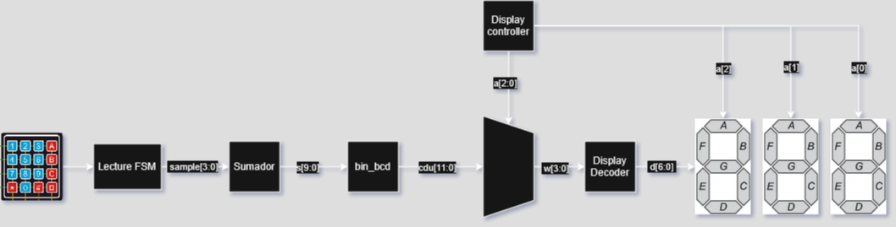
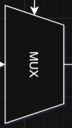

# Proyecto 1 Diseño Logico

## 1. Abreviaturas y definiciones
- **FPGA**: Field Programmable Gate Arrays
- **Sumador**: Circuito digital que suma 2 numeros
- **Flip Flop**: Circuitos que permite almancenar un valor binario
- **Debounce**: Un debounce (o antirrebote) es una técnica usada en electrónica digital para eliminar señales erróneas causadas por el rebote mecánico de botones o interruptores.

## 2. Descripción general del sistema


<div style="text-align: justify"> Este circuito de manera general se encarga de recibir 2 numeros por medio de un teclado hexadecimal, los cuales son almacenados de manera interna por medio de flip flops, los cuales se encuentran controlados por una maquina de estados. Los numeros pasan por un debouncer, el cual permite limpiar toda la señal de entrada de manera que solo se reciba el numero. Una vez que la señal se filtro, se lleva directamente al modulo de la maquina de estados que suma. La maquina de estados se encarga de que al recibir la señal de una tecla presionada, este valor sea guardado en un los digitos de cada uno de los numeros a sumar, la primera tecla son las centenas, la segunda las decenas y la ultima llena las unidades. Una vez que se tienen los 2 numeros, estos se suman, la suma tambien es guardada por medio de un flip flop en la maquina de estados. Por ultimo, este numero se despligueda por medio de un mux que le indica a cada display que despleguar y un display decoder, que transfiere el numero a su respectivo codigo en 7 segment display. </div>
 

### **2.1 Módulo `DeBounce`**
#### 1. Funcionamiento
<div style="text-align: justify"> El codificador de Hamming se encarga de recibir el mensaje codificado enviado desde los Dip Switches y lograr realizar una decodificación de Hamming al obtener los síndromes necesarios para lograr posicionar el error presente en este. Para esto se realiza la decodificación con los bits de paridad y se asignan a p[2:0] dejando el cuarto bit siempre en 0. Por último, este mismo modulo se encarga de lanzar los valores del número correcto hacia las leds de la FPGA, permitiendo desplegar el numero correcto ahi. </div>

#### 2. Encabezado del módulo
```SystemVerilog
module DeBounce (
    input  logic clk,
    input  logic n_reset,
    input  logic button_in,
    input  logic [3:0] columnas,           // columnas del teclado
    output logic DB_out,                   // salida debounced de 1s
    output logic [3:0] columna_presionada  // columna registrada
);
```
#### 3. Parámetros
```SystemVerilog
    parameter N = 6;
    parameter integer MAX_COUNT = 15_000_000; // 1s @ 27MHz

    // Señales internas
    reg [N-1:0] q_reg, q_next;
    reg DFF1, DFF2;
    wire q_reset = (DFF1 ^ DFF2);
    wire q_add   = ~q_reg[N-1];

    logic [31:0] counter;
    logic active;
```


#### 4. Criterios de diseño


#### 5. Testbench
En este caso, el test bench se observa por medio del wave view


### **2.2 Módulo `disp_controller`**
#### 1. Funcionamiento
<div style="text-align: justify"> El módulo disp_controller se encarga de dividir la frecuencia ademas de enlazar esto con un One Hot, el cual sera transmitido hacia el mux para poder decirle a cada display cual de los valores representar y ademas cuando tienen que activarse. Esto seria la variable "a". </div>

#### 2. Encabezado del módulo
```SystemVerilog
module disp_controller(
    input logic clk,
    output logic [3:0] a
);

```
#### 3. Parámetros
```SystemVerilog
    parameter int frequency = 27_000_000;               // Frecuencia de entrada en Hz
    parameter int max_count = frequency * 1/1000; // Cuenta máxima del contador
    logic [24:0] count;  // Contador con tamaño suficiente
```


#### 4. Criterios de diseño


#### 5. Testbench
Time =                    0 ns, 7segOn = 0,0,1
Time =           1000061000 ns, 7segOn = 0,1,0
Time =           2000141000 ns, 7segOn = 1,0,0
Time =           3000221000 ns, 7segOn = 0,0,0
Time =           4000301000 ns, 7segOn = 0,0,1
Time =           5000381000 ns, 7segOn = 0,1,0
Time =           6000461000 ns, 7segOn = 1,0,0
Time =           7000541000 ns, 7segOn = 0,0,0
Time =           8000621000 ns, 7segOn = 0,0,1
Time =           9000701000 ns, 7segOn = 0,1,0

### **2.3 Módulo `disp_dec`**
#### 1. Funcionamiento
<div style="text-align: justify">El display decoder se encarga de recibir la señal del modulo sume, el cual basicamente da el resultado de la suma de los 2 digitos. Por medio de la variable cdu, el cual es un numero de 4 digitos (16 bits) se dividen los digitos por medio del mux, dando como resultado w. Esta variable es trabajada como un hot one, que activa uno de los digitos especificamente, el cual se ve reflejado por el d.</div>

#### 2. Encabezado del módulo
```SystemVerilog
module disp_dec(
    input logic [3:0] w, 
    output logic [6:0] d
);

```
#### 3. Parámetros
```SystemVerilog
Number: 0000, Segments: 1111110
Number: 0001, Segments: 0110000
Number: 0010, Segments: 1101101
Number: 0011, Segments: 1111001
Number: 0100, Segments: 0110011
Number: 0101, Segments: 1011011
Number: 0110, Segments: 1011111
Number: 0111, Segments: 1110000
Number: 1000, Segments: 1111111
Number: 1001, Segments: 1111011
```


#### 4. Criterios de diseño


#### 5. Testbench
----


### **2.4 Módulo `lecture`**
#### 1. Funcionamiento
<div style="text-align: justify">Este modulo se encarga de recibir los inputs directamente del circuito, estas siendo los variables llamadas raw. Una vez que se reciben estas señales estas son inicializadas por medio de 4 instancias del DeBounce, el cual logra filtrar por completo la señal, dando como resultado solamente el valor de la señal del numero presionado. Una vez que esto pasa, la salida se pasa por un tipo de decoder, retornando por medio de sample, el numero presionado.</div>


#### 2. Encabezado del módulo
```SystemVerilog
module lecture (
    input logic clk,
    input logic n_reset,
    input logic [3:0] filas_raw,        // Entradas directas desde las filas del teclado
    output logic [3:0] columnas,
    output logic [3:0] sample           // Salidas debouneada
);      
```
#### 3. Parámetros
```SystemVerilog
    logic [3:0] columna_presionada0; //4 columna_presionada para un trucazo mistico
    logic [3:0] columna_presionada1;
    logic [3:0] columna_presionada2;
    logic [3:0] columna_presionada3;
    logic [3:0] columna_presionada_total;
    logic [3:0] filas_db; // Muestreo de filas sin rebote


    columnas_fsm fsm (
        .clk(clk),
        .columnas(columnas)
    );

    DeBounce db0 (
        .clk(clk),
        .n_reset(n_reset),
        .button_in(filas_raw[0]),
        .columnas(columnas),
        .DB_out(filas_db[0]),
        .columna_presionada(columna_presionada0)
    );
 
    DeBounce db1 (
        .clk(clk),
        .n_reset(n_reset),
        .button_in(filas_raw[1]),
        .columnas(columnas),
        .DB_out(filas_db[1]),
        .columna_presionada(columna_presionada1)
    );

    DeBounce db2 (
        .clk(clk),
        .n_reset(n_reset),
        .button_in(filas_raw[2]),
        .columnas(columnas),
        .DB_out(filas_db[2]),
        .columna_presionada(columna_presionada2)
    );

    DeBounce db3 (
        .clk(clk),
        .n_reset(n_reset),
        .button_in(filas_raw[3]),
        .columnas(columnas),
        .DB_out(filas_db[3]),
        .columna_presionada(columna_presionada3)
    );

 
    assign columna_presionada_total = columna_presionada0 | columna_presionada1 | columna_presionada2 | columna_presionada3; // Unir las columnas presionadas
```


#### 4. Criterios de diseño


#### 5. Testbench
Para este modulo, el test bench tiene sus datos depositados en un archivo vcd

### **2.5 Módulo `mux`**

#### 1. Funcionamiento
<div style="text-align: justify">El mux especificamente se encarga de recibir el uno de los valores del One Hot (a), para de esta manera, mandar la señal correcta del display. Esto se envia por medio de la variable w, la cual extrae el digito correcto del numero de cdu. </div>

#### 2. Encabezado del módulo
```SystemVerilog
module mux(
    input logic [2:0] a,    // Maquina de estados one-hot
    input logic [15:0] cdu,    // cdu[3:0] = unidades, cdu[7:4] = decenas, cdu[11:8] = centenas
    output logic [3:0] w    // Numero de 4 bits (salida)
);
```
#### 3. Parámetros
```SystemVerilog
    assign w = (a == 4'b0001) ? cdu[3:0] :  // unidades
               (a == 4'b0010) ? cdu[7:4] :  // decenas 
               (a == 4'b0100) ? cdu[11:8] : // centenas
               (a == 4'b1000) ? cdu[15:12] : // Millares
               4'b0000;
```


#### 4. Criterios de diseño



#### 5. Testbench
Tiempo |   a   |    cdu    |  w
-------------------------------
  10ns | 001 | 011100110001 | 0001
  20ns | 010 | 011100110001 | 0011
  30ns | 100 | 011100110001 | 0111
  40ns | 000 | 011100110001 | 0000


### **2.6 Módulo `sume`**
#### 1. Funcionamiento
<div style="text-align: justify">.</div>

#### 2. Encabezado del módulo
```SystemVerilog
module sume (
    input  logic clk,
    input  logic [3:0] sample,  // Valor del teclado
    output logic [15:0] cdu,         // Resultado de la suma
    output logic [3:0] debug
);
```
#### 3. Parámetros
```SystemVerilog
    typedef enum logic [2:0] {S0, S1, S2, S3, S4, S5, S6} statetype;
    statetype state=S0;  // Iniciar directamente en S0
    // Variables internas
    logic [11:0] w1, w2;
    logic [3:0] sample_A;
    logic flag;
    assign debug = ~state;
```


#### 4. Criterios de diseño


#### 5. Testbench
-----

### **2.7 Módulo `top`**
#### 1. Funcionamiento
<div style="text-align: justify">Este modulo se encarga de conectar el resto, por medio de las variables iniciales que son usadas en el primer modulo, ademas de los outputs que se tienen que sacar en al final. Ademas, en este modulo se instancia el resto, designando cuales variables reciben, las conexiones de los cables y definir las salidas. </div>

#### 2. Encabezado del módulo
```SystemVerilog
module top(
    input logic clk,
    input logic [3:0] filas_raw, // Entradas directas desde las filas del teclado
    output logic [6:0] d,  // Segmentos
    output logic [3:0] a, // Control de los segmentos
    output logic [3:0] columnas, // Salida de la FSM de columnas 
    output logic [3:0] led  // Senal de debug
    );       // Sindrome
```
#### 3. Parámetros
```SystemVerilog
    disp_dec decoder (.w(w), .d(d));
    disp_controller controller (.clk(clk), .a(a));
    mux mux (.a(a), .cdu(cdu), .w(w));
 
    sume suma (
    .clk(clk),              
    .sample(sample),       
    .cdu(cdu),
    .debug(led)              
    );

    lecture lect (
        .clk(clk),
        .n_reset(n_reset),
        .filas_raw(filas_raw),
        .columnas(columnas),
        .sample(sample)
    );

```


#### 4. Criterios de diseño


## 4. Problemas encontrados durante el proyecto
Durante la realización del proyecto se encontraron varios problemas:
1.  Diseño y logica de como armar y organizar el proceso de la información.
2.  Tratar de codificar correctamente cada uno de los modulos.
3.  La implementacion correcta de la funcion del codigo con respecto al circuito y la FPGA en si
4.  Debugeo del circuito y el codigo.


## Apendices:


## 1. Referencias
[0] OpenAI. (2025). ChatGPT conversation about debounce. Retrieved from [https://chatgpt.com/c/68237c47-c858-8005-937f-59e6cbdb20d2]